# 
Git 学习笔记

## 一、Git 基本概念
### 1. git中三大区域：
+ **工作区(workding directory):** 电脑上的本地目录
+ **暂存区域(staging area / index):** 临时存储区域，用于保存即将提交到Git仓库的修改内容（意义在于不必每次修改完一个文件就commit一次，而是可以先添加到暂存区，等所有文件都修改完成后，一并commit到repository）
+ **本地仓库(local repository):** 包含完整的项目历史和源数据，是git存储版本信息和代码的主要位置
- **流程：** 工作区 → git add → 暂存区 → git commit → 本地仓库

### 2. git中文件状态
- **未跟踪(untrack)：** 新创建的还未被git管理的文件
- **未修改(unmodified)：** 已经被git管理，但文件内容还未修改
- **已修改(moedified)：** 已修改但还未添加到暂存区的文件
- **已缓存(staged)：** 已修改并已添加到暂存区内的文件
- **流程：** 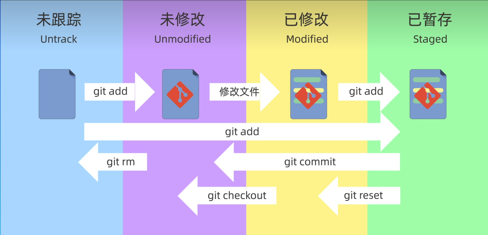{: width="350"}
  ps：git commit 命令只会提交==暂存区内的文件==

### 3.远程仓库
- GitHub：最大的开源平台
- Gitee：国内平台
- Gitlab：私有化部署

## 二、 git指令
- **git reset：** **回溯**版本至之前某一次commit的版本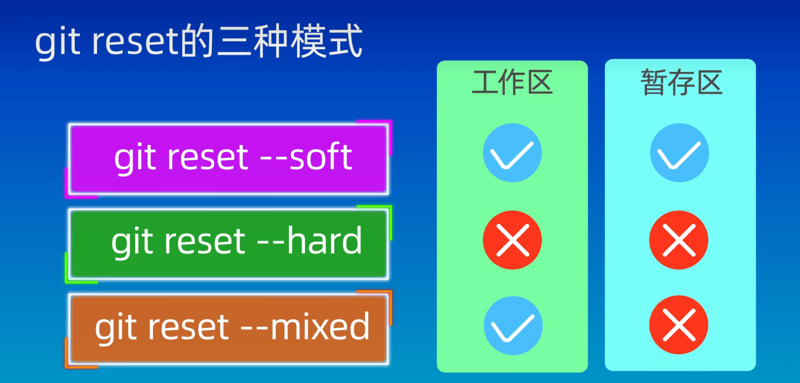{: width="350"}
ps：当连续commit多个版本，但又觉得这些commit没有太大意义，就可利用git reset回退到某个版本，再重新commit，从而将这些连续提交合并为一个版本。（谨慎使用git reset --hard,此命令会清空选中版本与当前版本==之间==的工作区与暂存区内容）
 

- **git rm：** 同时在工作区与暂存区删除文件
  ps：linux下的rm指令只会删除工作区内容，而暂存区内容则需要git add命令更新删除。
 

- **gitignore:** 忽略文件，不需要提交到仓库的文件{: width="350"}
   
- **rm -rf .git:** 删除本地仓库(即删除文件夹里隐藏的.git文件)

## 三、Github

### 1.创建仓库
1. 从远程服务器clone已存在的仓库`git clone`
2. 本地创建仓库`git init`

### 2. 加密传输
本地仓库与远程仓库关联时，涉及加密传输。此时可选择采用**https**或**ssh**协议进行传输。
  （https每次传输需验证用户名及密码。ssh则只需配置一次公钥文件，后续则可无需验证登录。）
  ps:设置ssh密钥时直接回车了，无密码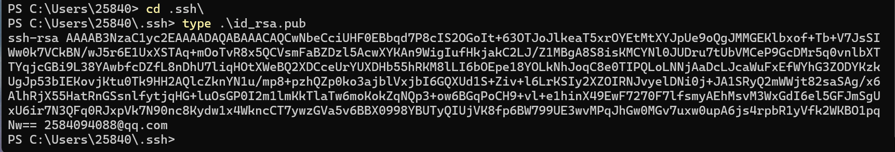{: width="350"}

### 3.关联远程仓库与本地仓库
1.将已有的远程仓库clone到本地仓库完成关联
2.将已有的本地仓库remote add到远程仓库完成关联
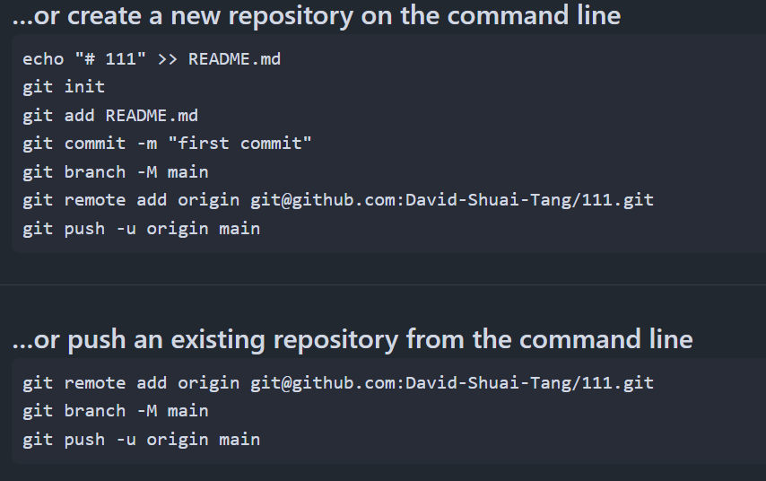{: width="350"}
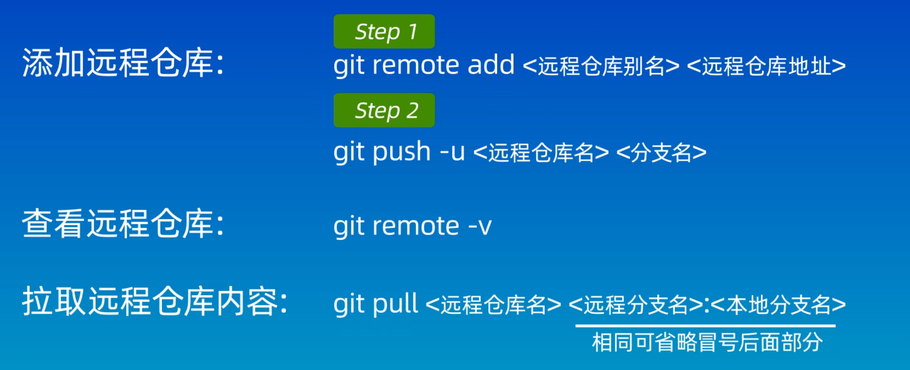{: width="350"}
>ps:
>>1.`git remote add <远程仓库别名>  < url >`命令中，要设置远程仓库别名，是因为允许一个本地仓库关联多个远程仓库（可以使用`git remote remove <远程仓库别名>`命令删除已关联的远程仓库）
>>
>>2.`git branch -M main`为指定分支名称为main
>>3.关联后需使用`git push -u origin main`来将本地仓库的main分支推送给远程仓库的main分支

### 4. pull、push、clone
- `git clone`:从远程服务器克隆一个一模一样的版本库到本地，复制的是整个版本库，是一个本地**从无到有**的过程，是远程操作的第一步
 
- `git pull`:取回远程主机**某个分支**的更新，再与本地的指定分支合并
  

- `git push`:将本地分支的更改**推送到**远程仓库

  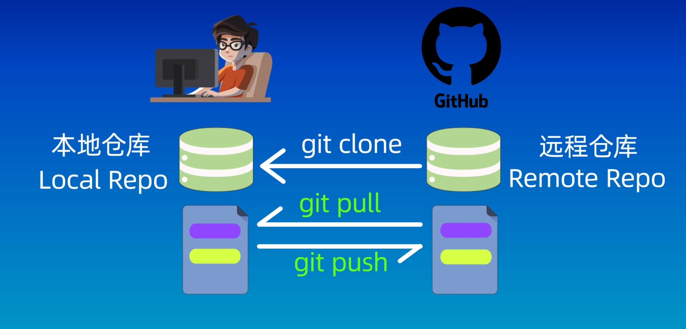{: width="350"}
  

- git pull、git fetch区别
  {: width="350"}

## 四、分支(branch)
- **git branch:** 展示当前仓库所有分支，*为当前所在分支
- **git branch <分支名称>：** 创建一个新的分支
- **git checkout <分支名称>:** 切换到不同分支(易出现歧义)
- **git switch <分支名称>：** 切换到不同分支
- **git merge <分支名称>:** 将选中分支合并到**当前所在分支**
  >ps: 
    1.合并后选中分支依然存在，若要删除需使用`git branch -d <分支名称>`手动删除
    2.在未合并前需要删除分支，则须使用`git branch -D <分支名称>`
 

- **合并冲突**
  当两个分支都修改了相同的文件，此时合并会提示合并失败，需手动修改冲突文件后，再提交至暂存区，最后commit即可完成合并。

## 五、变基(rebase)
- **git rebase <分支名称>：**从分叉点将整个分支(当前分支)都移动到目标分支的**最新**提交记录后面
  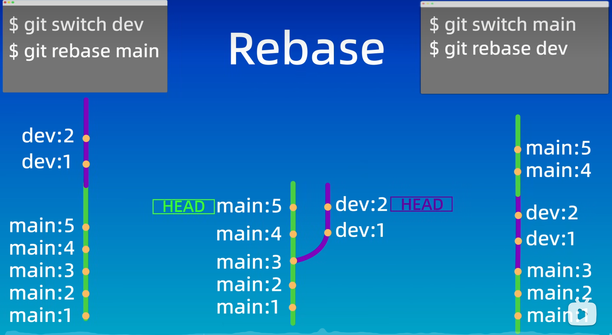{: width="350"}
 

- **merge与rebase**
  {: width="350"}
  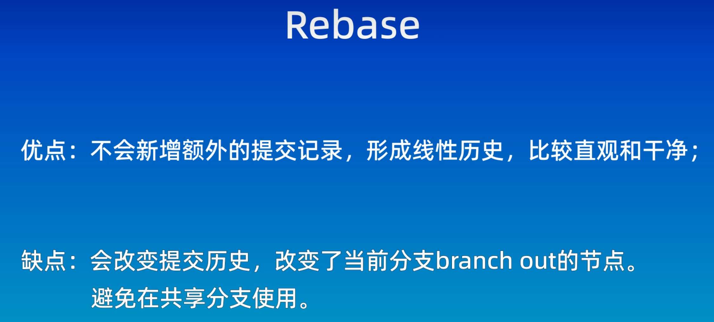{: width="350"}

## 六、Git flow工作流
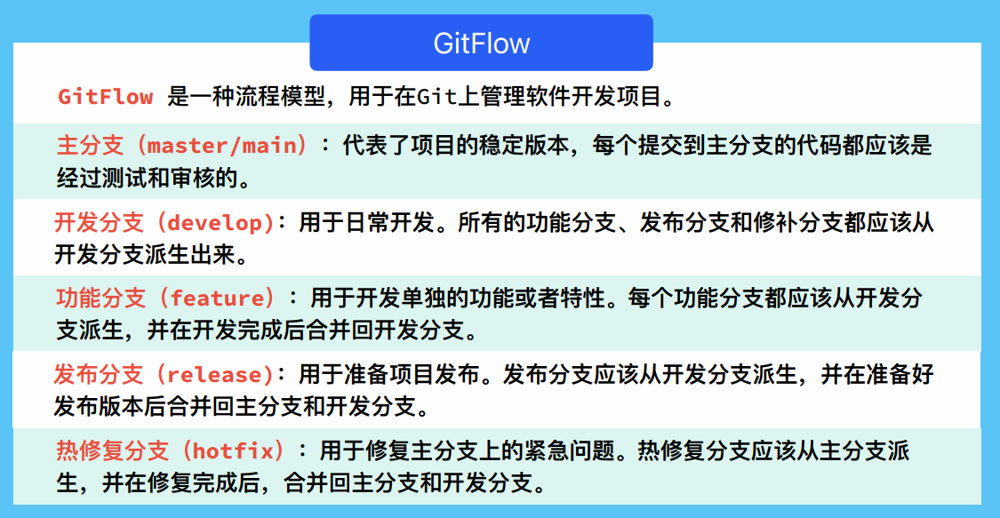{: width="350"}
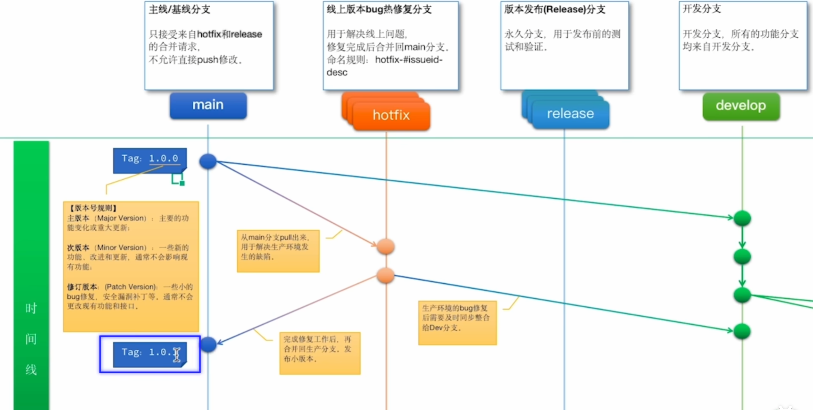{: width="350"}
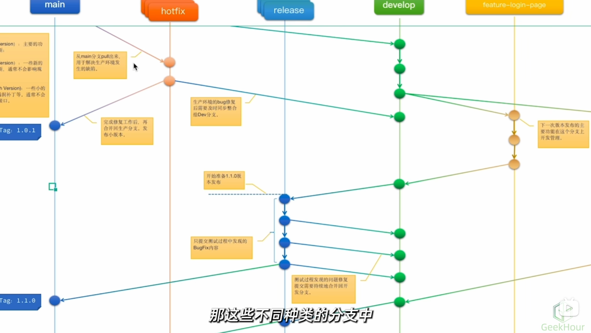{: width="350"}

---

# 
vscode 中 git 的使用方法

## 一、新建文件使用git,并上传到GitHub
在工作区编辑好文件并保存(ctrl+s)后，点击左侧git键，进入到git工作区，点击在Message处输入本次版本名称后，点击commit。即可在git中生成此文件的第一个版本。

commit后，该键变为Publish Branch，点击Publish Branch再选择private or publish，则将现版本以当前workspace名称，在GitHub上新建一个repository并上传其中。

而左下角列表为，查看历史版本的==只读==文件。
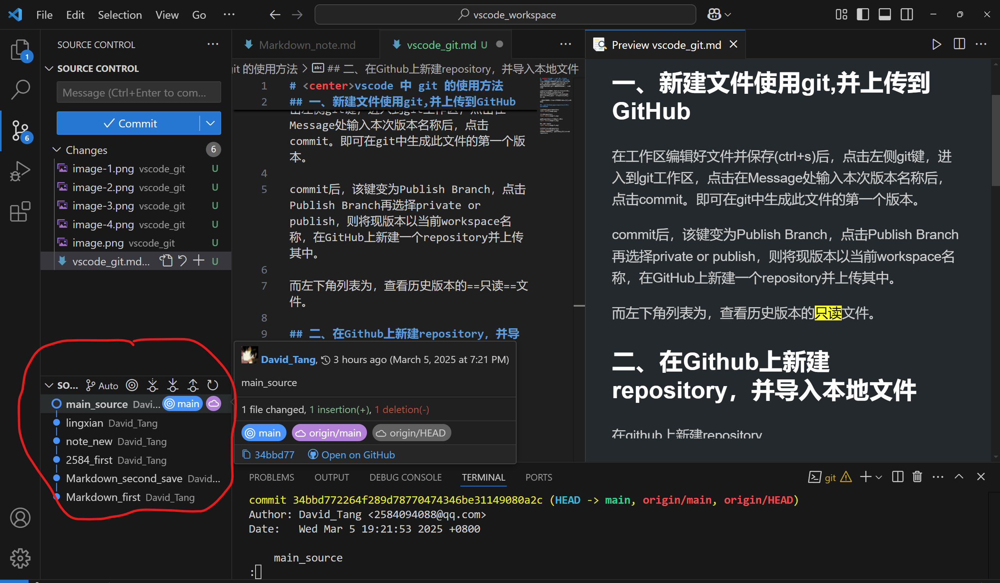{: width="350"}

## 二、在Github上新建repository，并导入本地文件

在github上新建repository
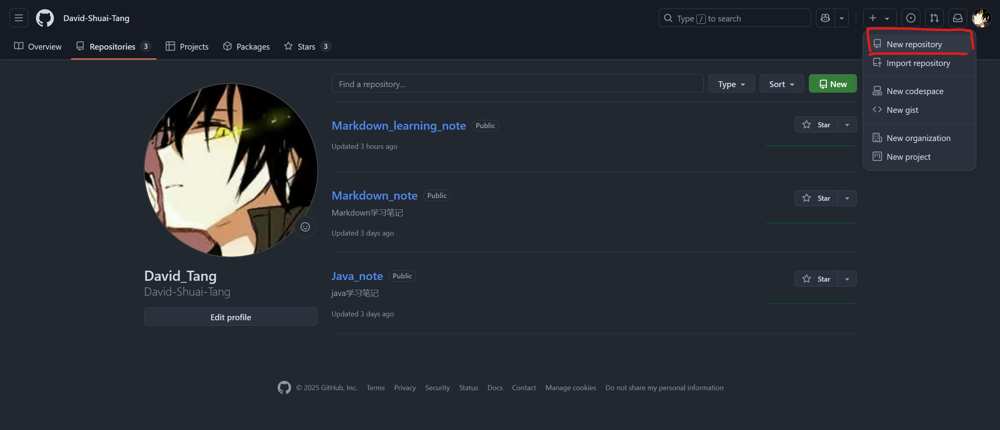{: width="350"}

初始化repository
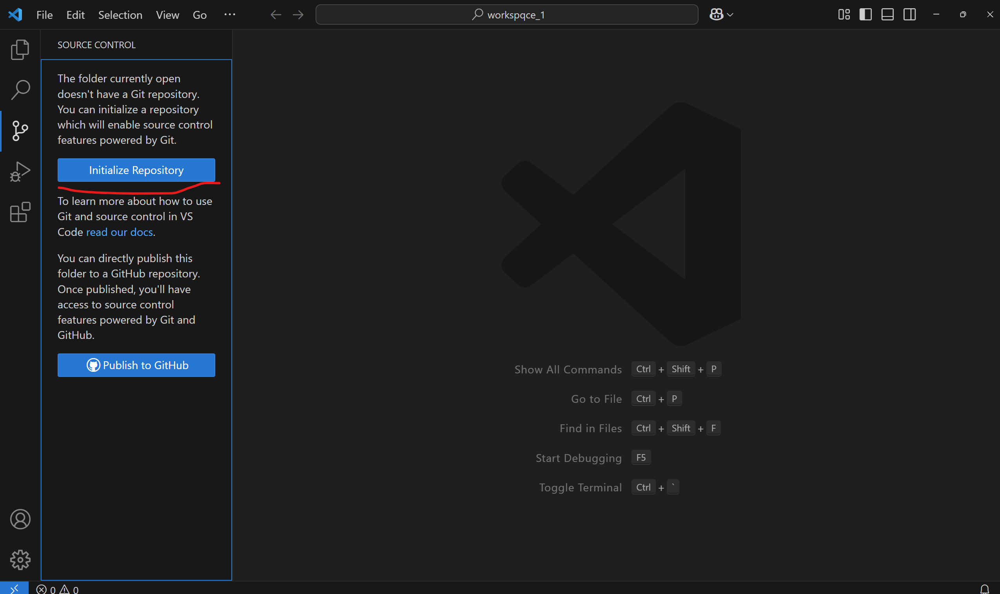{: width="350"}

提交commit（利用本地git实现）
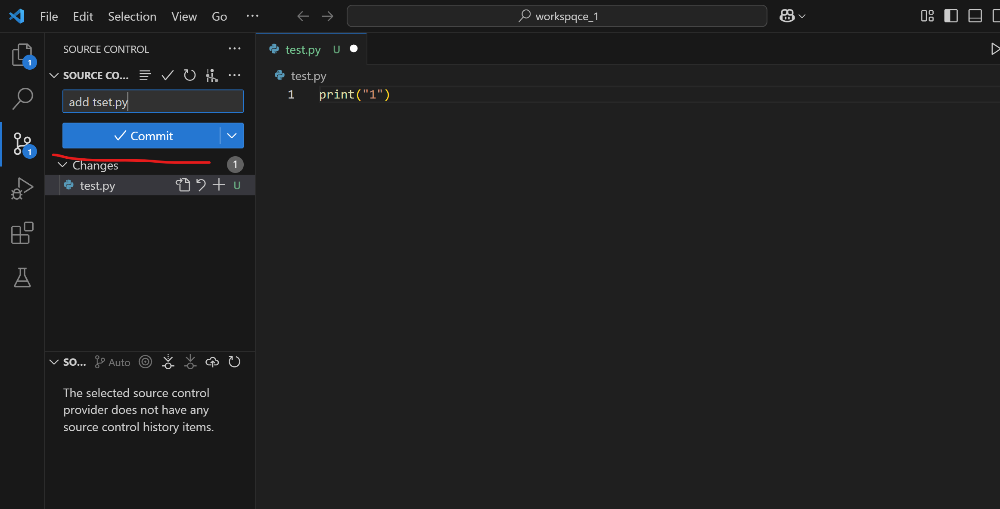{: width="350"}

点击add remote
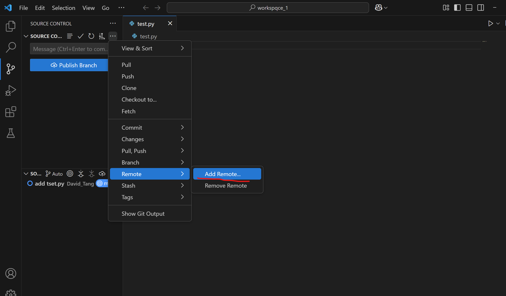{: width="350"}

选择已创建好的repository(此操作等于`git remote add <远程仓库别名>  < url >`)
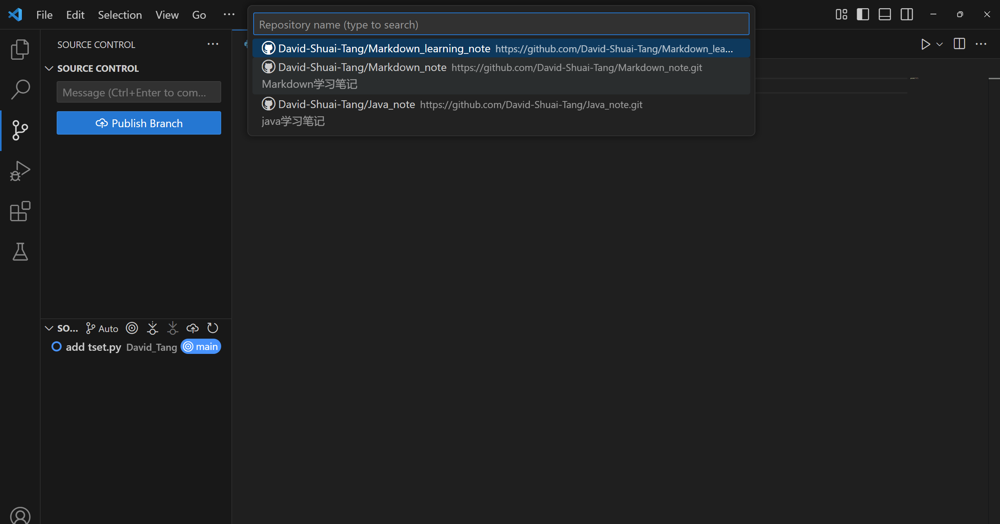{: width="350"}
 
再点击public branch(此操作等于`git push -u origin main`)，即可将本地文件上传到GitHub上已创建好的repository

## 三、Tips

1.利用vscode插件Git Graph查看版本分支图
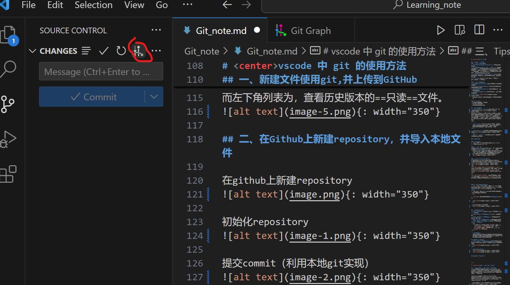{: width="350"}
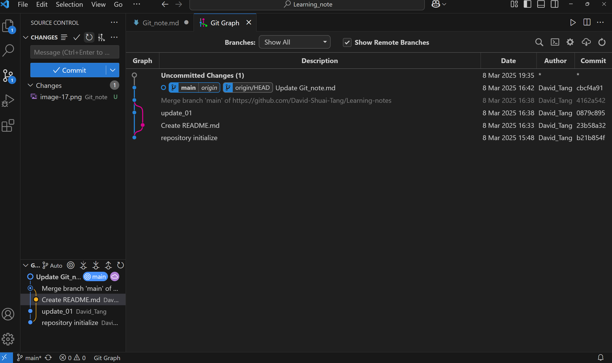{: width="350"}

2.vscode左下角标签显示当前所在分支