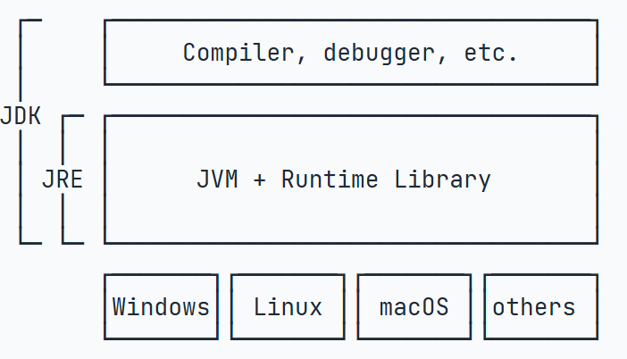

# <center>Java学习笔记

## 一、Java 特性
### 1. java版本
java se（标准版）：桌面应用开发
java me（移动版）：移动应用开发
Java ee（企业版）：企业应用开发，web应用开发。
>JavaEE并不是一个软件产品，它更多的是一种软件架构和设计思想。我们可以把JavaEE看作是在JavaSE的基础上，开发的一系列基于服务器的组件、API标准和通用架构。
>>JavaEE最核心的组件就是基于Servlet标准的Web服务器，开发者编写的应用程序是基于Servlet API并运行在Web服务器内部的

- JDK：Java Development Kit
- JRE：Java Runtime Environment
  


### 2. java跨平台性
java的跨平台性，是由于每个os都装有不同版本的java虚拟机（jvm），从而做到运行只依赖于java虚拟机，而与os无关。（一处编译，处处运行）

### 3. 环境变量

Path环境变量是让系统程序的路径，方便程序员在命令行窗口的 %任意目录% 下启动程序；

### 4. 工程嵌套 
java中的工程嵌套：
project(项目) → module(模块) → package(包) → class(类)

即：最终在每一个类文件中编写代码。
ps：Java中最基本的组成单位为类


### 5.Tips

1. **src:** 在 Java 项目中，src 是 source 的缩写，表示源代码文件夹。这个文件夹主要用于存放项目的源文件，即以 .java 为后缀的文件和一些配置文件
   > (src 文件夹将源代码与其他类型的文件（如模板文件、Web 文件等）区分开来。这有助于保持项目结构的清晰和整洁)


2. 


---

## 二、Java 语法
### 1.程序基础
#### 1.1 基础结构
Java是面向对象的语言，一个程序的**基本单位就是class**，class是关键字，这里定义的class名字就是Hello

类名要求：
- 类名必须以英文字母开头，后接字母，数字和下划线的组合
- 习惯以**大写字母开头**

```public class Hello {
    public static void main(String[] args) {
        // 向屏幕输出文本:
        System.out.println("Hello, world!");
        /* 多行注释开始
        注释内容
        注释结束 */
    }
} // class定义结束 
``` 

> 注意到**public是访问修饰符**，表示该class是公开的。
不写public，也能正确编译，但是这个类将无法从命令行执行。
在class内部，可以定义若干方法（method）：
```
public class Hello {
    public static void main(String[] args) { // 方法名是main
        // 方法代码...
    } // 方法定义结束
}
```
>这里的**方法名是main**，返回值是void，表示没有任何返回值。
我们注意到public除了可以修饰class外，**也可以修饰方法**。而关键字**static是另一个修饰符，它表示静态方法**
>>ps：Java入口程序规定的方法必须是静态方法，方法名必须为main，括号内的参数必须是String数组

方法名也有命名规则，命名和class一样，但是**首字母小写**


```
public class Hello {
    public static void main(String[] args) {
        System.out.println("Hello, world!"); // 语句
    }
}
```
> 在方法内部，语句才是真正的执行代码。Java的每一行语句必须**以分号结束**

#### 1.2 数据类型
Java定义了以下几种**基本数据**类型：
- 整数类型：byte，short，int，long
- 浮点数类型：float，double
- 字符类型：char
- 布尔类型：boolean
byte恰好就是一个字节，而long和double需要8个字节

<br/>

**引用数据**类型包括类、接口、数组、枚举、注解和字符串等
引用数据类型的特点：
1. 存储方式：引用数据类型的变量在栈上存储引用（句柄），而对象的具体信息存储在堆内存上。引用变量指向堆中对象的地址
2. 默认值：引用数据类型的默认值是null，表示没有引用指向任何对象
3. 参数传递：引用数据类型作为方法的参数传递时，传递的是对象的引用，可以修改对象的属性或状态
4. 复制操作：引用数据类型进行复制时，只会复制对象的引用，两个变量指向同一个对象


**常量：**
定义变量的时候，如果加上**final**修饰符，这个变量就变成了常量：
```
final double PI = 3.14; // PI是一个常量
double r = 5.0;
double area = PI * r * r;
PI = 300; // compile error!
```
常量在定义时进行初始化后就**不可再次赋值**，再次赋值会导致编译错误。
为了和变量区分开来，根据习惯，常量名通常**全部大写**

定义变量时，要遵循作用域最小化原则，尽量将变量定义在**尽可能小的作用域**，并且，**不要重复使用**变量名


#### 1.3 运算
**运算优先级**
在Java的计算表达式中，运算优先级从高到低依次是：
- ()
- ! ~ ++ --
- \* / %
- \+ -
- << >> >>>
- &
- |
- += -= *= /=

**三元运算符**
Java还提供一个三元运算符`b ? x : y`，它根据第一个布尔表达式的结果，分别返回后续两个表达式之一的计算结果
三元运算`b ? x : y`会首先计算b，如果b为true，则只计算x，否则，只计算y。此外，x和y的类型必须相同，因为返回值不是boolean，而是x和y之一

**字符串连接**
Java的编译器对字符串做了特殊照顾，可以使用+连接任意字符串和其他数据类型，这样极大地方便了字符串的处理。如果用+连接字符串和其他数据类型，会将其他数据类型先自动转型为字符串，再连接。

字符串可以用"""..."""表示**多行字符串**（Text Blocks）


Java的字符串除了是一个**引用类型**外，还有个重要特点，就是字符串**不可变**。
> ps：引用数据类型是Java中两大数据类型之一，区别于基本数据类型。引用数据类型包括类、接口、数组、枚举、注解和字符串等


#### 1.4 流程控制
**输入与输出**

使用`System.out.println()`来向屏幕**输出**一些内容。
> println是print line的缩写，表示输出并换行。因此，如果输出后不想换行，可以用print()

**格式化输出**使用System.out.printf()，通过使用占位符%?，printf()可以把后面的参数格式化成指定格式


通过import语句导入`java.util.Scanner`,创建Scanner对象并传入`System.in`,有了Scanner对象后，要读取用户**输入的字符串**，使用`scanner.nextLine()`，要读取用户**输入的整数**，使用`scanner.nextInt()`。Scanner会自动转换数据类型，因此不必手动转换


**if条件判断**
```// 条件判断
public class Main {
    public static void main(String[] args) {
        int n = 70;
        if (n >= 90) {
            System.out.println("优秀");
        } else if (n >= 60) {
            System.out.println("及格了");
        } else {
            System.out.println("挂科了");
        }
        System.out.println("END");
    }
}
```


**switch多重选择**
```
// switch
public class Main {
    public static void main(String[] args) {
        int option = 99;
        switch (option) {
        case 1:
            System.out.println("Selected 1");
            break;
        case 2:
            System.out.println("Selected 2");
            break;
        case 3:
            System.out.println("Selected 3");
            break;
        default:
            System.out.println("Selected other");
            break;
        }
    }
}
```
<br/>
**循环**
while、dowhile、for、for each


<br/>


**break、continue**
break语句总是跳出最近的一层循环；
continue语句可以提前结束本次循环；
break会跳出当前循环，也就是**整个**循环都不会执行了，而continue则是提前结束**本次**循环，直接继续执行**下次**循环

### 2.面向对象编程 
#### 2.1 面向对象基础
在Java中，创建一个类，例如，给这个类命名为Person，就是定义一个class：
```
class Person {
    public String name;
    public int age;
}
```
一个class可以包含多个**字段（field）**，字段用来描述一个类的特征。上面的Person类，我们定义了两个字段，一个是String类型的字段，命名为name，一个是int类型的字段，命名为age。因此，通过class，把一组数据汇集到一个对象上，实现了数据封装。

public是用来修饰字段的，它表示这个字段**可以被外部访问**。

<br/>
定义了class，只是定义了对象模版，而要根据对象模版创建出真正的对象实例，必须用new操作符。

**new操作符**可以**创建一个实例**，然后，我们需要定义一个引用类型的变量来指向这个实例：
```
Person ming = new Person();
```
> ps: 注意区分Person ming是定义Person类型的变量ming，而new Person()是创建Person实例

<br/>

访问实例变量可以用**变量.字段**，例如：
```
ming.name = "Xiao Ming"; // 对字段name赋值
ming.age = 12; // 对字段age赋值
System.out.println(ming.name); // 访问字段name

Person hong = new Person();
hong.name = "Xiao Hong";
hong.age = 15;
```
> ps:一个Java源文件**可以包含多个类**的定义，但**只能定义一个public类**，且public类名必须与文件名一致。如果要定义多个public类，必须拆到多个Java源文件中。

#### 2.2 方法
为了避免外部代码直接去访问field，我们可以用private修饰field，拒绝外部访问。把field从public改成private，外部代码不能访问这些field。需要使用**方法（method）** 来让外部代码可以**间接修改**field

```
public class Main {
    public static void main(String[] args) {
        Person ming = new Person();
        ming.setName("Xiao Ming"); // 设置name
        ming.setAge(12); // 设置age
        System.out.println(ming.getName() + ", " + ming.getAge());
    }
}

class Person {
    private String name;
    private int age;

    public String getName() {
        return this.name;
    }

    public void setName(String name) {
        this.name = name;
    }

    public int getAge() {
        return this.age;
    }

    public void setAge(int age) {
        if (age < 0 || age > 100) {
            throw new IllegalArgumentException("invalid age value");
        }
        this.age = age;
    }
}
```
> ps:`this`代表当前对象的引用，它始终指向当前实例

虽然外部代码不能直接修改private字段，但是，外部代码可以调用方法setName()和setAge()来间接修改private字段。在方法内部，我们就有机会检查参数对不对。比如，setAge()就会检查传入的参数，参数超出了范围，直接报错。这样，外部代码就没有任何机会把age设置成不合理的值。


### java多线程
Java语言内置了多线程支持：一个Java程序实际上是一个JVM进程，JVM进程用一个主线程来执行main()方法，在main()方法内部，我们又可以启动多个线程。此外，JVM还有负责垃圾回收的其他工作线程等。
Java多线程编程的特点又在于：

- 多线程模型是Java程序最基本的并发模型；
- 后续读写网络、数据库、Web开发等都依赖Java多线程模型。

要创建一个新线程非常容易，我们需要实例化一个Thread实例，然后调用它的start()方法：

```
public class Main {
    public static void main(String[] args) {
        Thread t = new Thread();
        t.start(); // 启动新线程
    }
}
```
> ps:当两个线程就开始同时运行，是由操作系统调度，程序本身无法确定线程的调度顺序。

<br/>

可以**对线程设定优先级**，设定优先级的方法是：

`Thread.setPriority(int n) // 1~10, 默认值5`
JVM自动把1（低）~10（高）的优先级映射到操作系统实际优先级上（不同操作系统有不同的优先级数量）。**优先级高的线程被操作系统调度的优先级==较高==**，操作系统对高优先级线程可能调度更频繁，但我们决**不能通过设置优先级来确保高优先级的线程一定会先执行**。

练习


---
## 三、web 开发
web开发通常指开发**服务器端**的web应用


---
## 四、Spring
>Spring是一个支持快速开发Java EE应用程序的**框架**，它提供了一系列底层容器和基础设施，并可以和大量常用的开源框架无缝集成

### 4.1 Springmvc

> Spring MVC 是 Spring 框架中专门处理Web请求的**模块**，采用经典的 MVC（Model-View-Controller）架构：
> - Controller：处理用户请求，返回逻辑结果
> - View：渲染界面（如JSP、Thymeleaf模板）
> - Model：传递数据给视图


---
## 五、spring boot
> Spring Boot是一个**基于Spring**的套件，它帮我们预组装了Spring的一系列组件，以便以**尽可能少的代码和配置**来开发基于Spring的Java应用程序。核心理念是“约定大于配置”，通过以下特性提升效率：
> - 内嵌 Tomcat/Jetty 服务器（无需手动部署）
> - 自动配置依赖（如添加 spring-boot-starter-web 一键配置Web开发环境）
> - 提供 Actuator 监控模块


---
## 六、spring cloud
> Spring Cloud顾名思义是跟云相关的，云程序实际上就是指分布式应用程序，所以Spring Cloud就是为了让分布式应用程序编写更方便，更容易而提供的一组基础设施，它的核心是Spring框架，利用Spring Boot的自动配置，力图实现最简化的**分布式应用程序开发**。


---

## 七、Javascript
> 一种**脚本语言**，主要在浏览器中运行，负责网页的动态交互（如表单验证、动画效果）。随着 Node.js 的出现，也可以在服务端运行。java与JavaScript二者名字相似但无血缘关系，JavaScript 更多**用于前端**（尽管Node.js能在服务端运行），而 Java 是**编译型语言**。


---


## 八、资源网址
1.java学习博客：https://liaoxuefeng.com/books/java/introduction/index.html
<br/>
2.Idea官方中文文档：https://intellijidea.com.cn/help/idea/getting-started.html 
<br/>
3.


## 一名优秀程序员的自我修养：
如果想提高学习效率，此时需要构建自己的学习框架：
比如再看一项技术的时候，可以从 What, Why, How 这个几个问题入手：
- What: 挖掘这个技术或者框架是干什么的
- Why: 它的优势在哪里，为什么要用它
- How: 怎么用， Tutorial 就可以带我们入门
  
**用20 % 的时间上手，之后精通需要耗费 80% 的时间。**
<br/><br/>


我们看了文档，我们了解这门技术

我们动手做了，我们掌握了这门技术

我们教别人了，我们精通了这门技术

**最好的学习方式是以分享驱动学习**。比如：写博客，讲 Session，或者教别人如何使用我们刚刚掌握的新技术。
